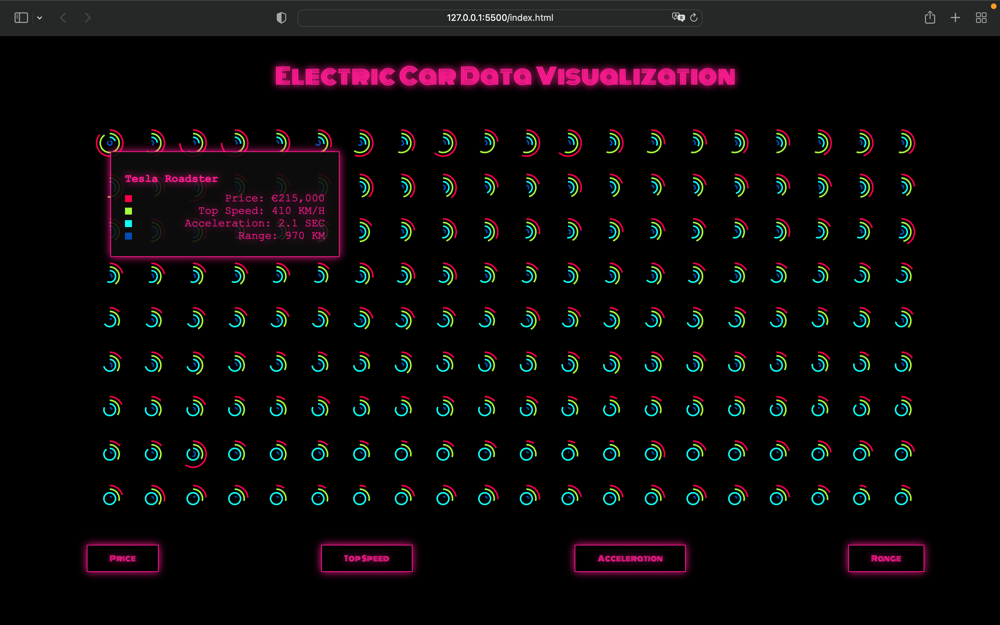

# Electric Car Data Visualization

### Overview

The Electric Car Data Visualization is a web application that dynamically displays a circular bar chart for various attributes of electric cars using D3.js. The chart visualizes data from a CSV file, enabling interactive exploration of electric car features such as Price, Top Speed, Acceleration, and Range. The visualization adjusts based on the selected attribute and provides interactive tooltips with detailed information.

### Features
* **Dynamic Data Visualization:** Displays electric car data as a series of concentric arcs, each representing a different attribute.
* **Interactivity:** Allows users to switch between different data attributes using buttons.
* **Responsive Design:** Adjusts visualizations based on the screen size.
* **Tooltips:** Shows detailed information about each car when hovered over.

### Technologies Used
* **HTML:** For structuring the webpage.
* **CSS:** For styling the page.
* **JavaScript:** For interactive behavior.
* **D3.js:** A JavaScript library for creating data visualizations.

### File Structure
* **index.html:** The main HTML file that contains the structure and embedded script for the visualization.
* **style.css:** The stylesheet for custom styling.
* **electric-cars.csv:** A CSV file containing the electric car data.

### How It Works
* **Loading Data:** The handleData function loads data from electric-cars.csv using D3's d3.csv method.
* **Data Processing:** The data is sorted based on the selected property (Price, Top Speed, Acceleration, or Range) in descending order.
* **Visualization Setup:** Defines dimensions and scales for the circular bar chart. Sets up scales for different attributes to convert data values into angular extents.
* **SVG Creation:** For each car, an SVG element is created containing concentric arcs. Different arcs represent different attributes with corresponding colors.
* **Transition and Animation:** Animates the drawing of arcs with a transition effect to enhance user experience.
* **Tooltips:** Displays a tooltip with detailed information about the car when hovering over its representation.
* **Usage:** Open index.html in a web browser to view the visualization. Select an attribute using the buttons (Price, Top Speed, Acceleration, Range) to update the visualization. Hover over any car to view a tooltip with detailed information.

### Code Overview

* **HTML:** Defines the layout with a title, buttons, and a placeholder for the graph.
* **CSS:** Style the visualization and tooltip.
* **JavaScript:** Utilizes D3.js to handle data visualization, transitions, and interactions.

### Dependencies
* **D3.js:** For data manipulation and visualization.

### Contribution
Feel free to contribute by creating a pull request or opening an issue for any bugs or feature requests. For major changes, please discuss them in an issue before implementing.

### License
This project is licensed under the MIT License. See the LICENSE file for details.
