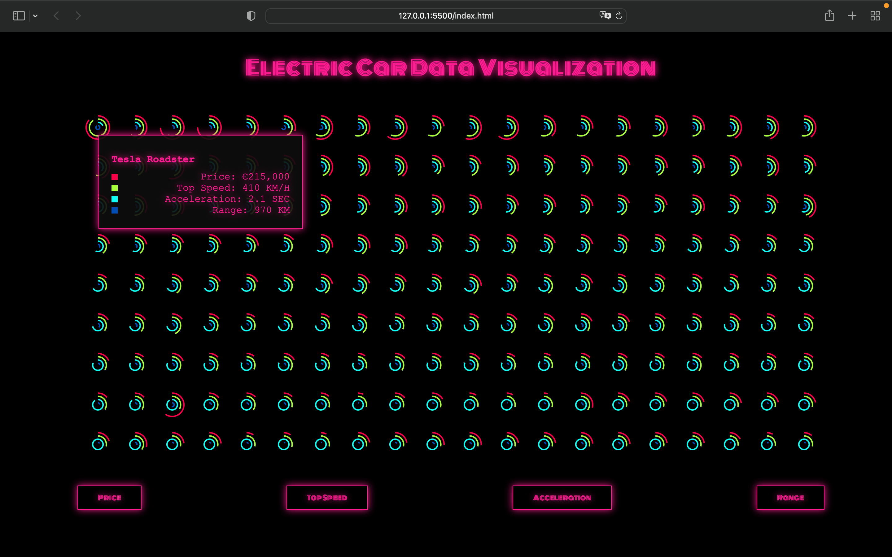

# Electric Car Data Visualization

- This web application is built with technologies such as HTML, CSS, SVG, D3, and JavaScript.
- This web application is using CSV file with current data about Electric Cars such as Name, BatterySize Acceleration, TopSpeed, Range, Efficiency, ChargeSpeed, Drive, Seats, and Price.